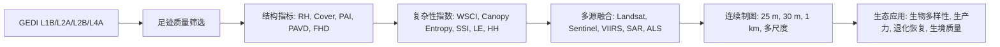

# GEDI数据在森林结构复杂性反演中的应用：文献整理总结

## 整理范围

本次共整理PDF文献 27 篇，其中与“GEDI数据在森林结构复杂性反演中的应用”高度相关 15 篇，中等相关 11 篇，低相关 1 篇。字段中凡未能从PDF可靠确定的信息均标注为“未说明”；未使用GEDI的文献在GEDI足迹筛选字段中标注为“不适用”。

## 研究热点

1. **从GEDI稀疏足迹到连续结构复杂性制图。** 典型路线是以GEDI足迹上的RH、cover、PAI、PAVD、FHD或综合复杂性指数为响应变量，再融合Sentinel、Landsat、VIIRS、SAR、地形和气候数据进行上尺度制图。欧洲森林结构多样性数据集使用Random Forest生成1/5/10 km结构多样性产品（Girardello et al., 2026）；哥伦比亚研究用590多万个GEDI足迹和SAR/多光谱影像生成25 m国家尺度结构图（Fagua et al., 2025）；美国西部野生动物生境研究生成30 m GEDI-fusion结构指标图（Vogeler et al., 2023）。

2. **构建可解释的结构复杂性综合指标。** 全球森林WSCI研究将GEDI RH metrics与ALS三维复杂性CE_XYZ连接，提出GEDI Waveform Structural Complexity Index（de Conto et al., 2024）。全球生产力稳定性研究采用canopy entropy并用GEDI与机载LiDAR估计全球CSC（Liu et al., 2024）。热带森林研究用PCA把4个GEDI结构指标合成为SSI（Zhang et al., 2024）。亚马逊退化研究用PCA和PC ratio表征森林结构状态连续梯度（Doyle et al., 2025）。

3. **FHD、PAVD、PAI成为复杂性/垂直结构应用的高频变量。** VIIRS-GEDI研究制图CH、PCC、PAI和FHD（Rishmawi et al., 2022）；美国通量上尺度研究表明加入GEDI RH和FHD可显著提升GPP/ET模型表现（Bu & Xiao, 未说明年份）；伊朗生物多样性研究中PAVD、FHD和3D体素指标常为重要预测变量（Darvand et al., 2026）。

4. **结构复杂性与生态功能、生物多样性和生境质量耦合。** GEDI结构指标被用于解释树种丰富度（Marselis et al., 2022；Xu et al., 2025）、森林生物多样性格局（Torresani et al., 2023；Darvand et al., 2026）、野生动物生境（Vogeler et al., 2023）、生产力和稳定性（Liu et al., 2024；Zhang et al., 2024；Bu & Xiao, 未说明年份）。

5. **GEDI质量控制与参数敏感性是方法基础。** 多篇文献强调degrade flag、quality flag、sensitivity、leaf-on/leaf-off、solar elevation、beam power等筛选条件。Vogeler et al. (2023) 使用solar elevation<0、degrade_flag=0、quality_flag=1、sensitivity>=0.95和full power beams；Rishmawi et al. (2022) 使用degrade_flag=0、solar elevation<0、leaf-off_flag=0、quality_flag=1等；Lahssini et al. (2022) 指出power/high-sensitivity beams对热带森林冠层高度估计非常关键。

## 常用数据源

- **GEDI产品：** L1B波形、L2A RH高度指标、L2B canopy cover/PAI/PAVD/FHD、L4A AGBD。
- **光学遥感：** Landsat、Sentinel-2、VIIRS、MODIS NIRv/NDVI/GPP、GOSIF。
- **雷达/SAR：** Sentinel-1、ALOS-2 PALSAR、TomoSAR/TomoSense。
- **验证与辅助数据：** ALS点云、UAV LiDAR、ForestGEO样地、AmeriFlux/NEON通量塔、NEON ALS、地形/气候/土壤/扰动产品。

## 主要方法

- **机器学习上尺度：** Random Forest最常见，应用于欧洲结构多样性制图、美国西部GEDI-fusion、哥伦比亚25 m结构图、VIIRS-GEDI年度结构制图、全球树种丰富度建模等。
- **深度学习/梯度提升：** XGBoost用于GPP/ET通量上尺度（Bu & Xiao）；CNN直接处理GEDI波形用于冠层高度估计（Lahssini et al., 2022）；LightGBM用于GEDI结构变量筛选（Darvand et al., 2026）。
- **综合指数构建：** WSCI、canopy entropy、SSI、Lorenz-entropy、PCA-derived forest state/PCR、height heterogeneity（Rao's Q等）。
- **统计与生态模型：** PCA、MNLR、SEM、SDM ensemble、variation partitioning、Lin's CCC、Mann-Whitney U和BH校正。

## 研究空白

1. **复杂性定义仍不统一。** WSCI、canopy entropy、FHD、PAVD、SSI、HH、Lorenz-entropy都可表征复杂性，但它们对应的是不同结构维度，跨研究可比性不足（de Conto et al., 2024；胡天宇等, 2025）。

2. **足迹尺度到连续栅格存在尺度不匹配。** GEDI约25 m足迹与30 m、25 m、1 km、5.6 km等栅格或样地尺度之间存在聚合和定位误差问题。Darvand et al. (2026) 明确指出GEDI定位误差使单足迹不宜直接匹配20×20 m样地。

3. **高质量足迹筛选标准尚未完全一致。** 不同研究对sensitivity、beam power、leaf-on/off、solar elevation、degrade flag的阈值不同，导致结果可比性和复现性需要特别说明。

4. **热带、温带、城市、人工林和退化林机制差异明显。** de Conto et al. (2024) 显示热带和温带森林中不同垂直层对复杂性的贡献不同；Doyle et al. (2025) 显示相近退化类别存在结构重叠。

5. **时间序列复杂性监测仍不足。** GEDI观测期有限，长时间序列通常需要VIIRS/Landsat/MODIS等历史数据融合。Rishmawi et al. (2022) 和Bu & Xiao提供了回推/上尺度思路，但复杂性本身的长期变化仍有空间。

## 可写选题方向

1. **基于GEDI L2A/L2B与Sentinel-1/2的区域森林结构复杂性连续制图。** 可借鉴Vogeler et al. (2023)、Fagua et al. (2025)和Girardello et al. (2026)，重点比较FHD/PAVD/PAI与综合指数的表现。

2. **GEDI足迹质量筛选对结构复杂性反演精度的影响。** 可围绕sensitivity、beam type、solar elevation、degrade_flag、leaf-on/off做敏感性分析，连接Lahssini et al. (2022)、Rishmawi et al. (2022)和Vogeler et al. (2023)。

3. **面向森林退化/恢复监测的GEDI结构状态指数构建。** 可参考Doyle et al. (2025)的PCA/PC ratio方法，并结合WSCI或canopy entropy构建更稳健的退化梯度指标。

4. **GEDI结构复杂性指标对生物多样性或生态功能的解释力比较。** 比较RH、FHD、PAVD、PAI、HH、WSCI、canopy entropy对树种丰富度、GPP/ET或生境模型的贡献，参考Marselis et al. (2022)、Xu et al. (2025)、Darvand et al. (2026)和Bu & Xiao。

5. **多尺度结构复杂性反演：足迹、样地、景观与区域尺度的一致性。** 解决GEDI足迹与样地/栅格尺度不匹配问题，特别适合章节中作为“方法挑战与展望”展开。

## 主题图

